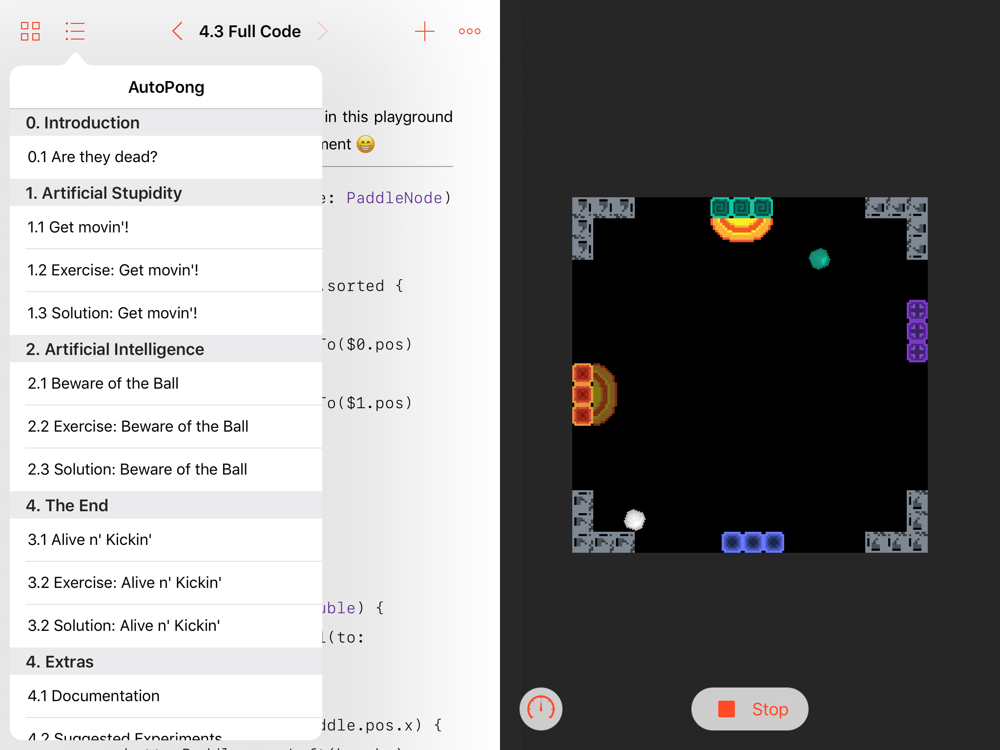

After trying a handful of different things and failing to see enough originality and quality in them, about three or four days from the deadline, i finally came up with the right idea.

{:class="img-responsive"}

Here is the description i sent to Apple:

>
I made my playground for the iPad (.playgroundbook format) using XCode on a MacBook.
I used the SpriteKit framework to create the environment in which the user will be walked through, step-by-step, the process of programming an "AI" for my 4-players version of Pong with original features and art.
>
My playground starts by showing the user, by way of examples and exercises, how to make the paddles move, then evolves by showing how to make them follow the balls and finally make the paddles "kick" whenever a ball is close, which is an additional feature i decided to implement. Additionally, the playground provides enough functionality for the user to implement his own features, such as, but not limited to user controlled paddles and score tracking.
>
It is not necessary to complete the exercises, since i provide a solution for each one in the page after.
>
In the final chapter i provide a small documentation, suggested experiments (additional exercises) and then in the last page of the playground is the complete editable code with all the features learned (perfect for experimenting).

### Why i think it was accepted

#### Description
I made it very clear what my project was and that there was more to it. I also tried excusing myself for the length by telling them they could just skip the exercises and go for the solutions if they wanted. They obviously did that, since there wouldn't be enough time.

#### Originality
I like to say this is one of the reasons it didn't get rejected and it is why i stopped working on some of my early ideas. Apple probably got flooded with playgrounds showcasing sorting algorithms, math concepts, binary trees, game of life clones and such. While many of them were amazing in quality, i think a large portion of them failed just because they weren't original. I saw lesser quality projects getting accepted over better quality projects simply because they were original.

#### Quality
I didn't cheap out on quality either. I paid attention to my code, the text and the visuals. It's very important to present a solid experience, make it clear that you know what you're doing.

#### iPad
Swift Playgrounds for iPad is the new thing. Apple loves when we adopt their new technology. I'm pretty sure those who sent iPad playgrounds had a small edge on those who sent Mac playgrounds.
